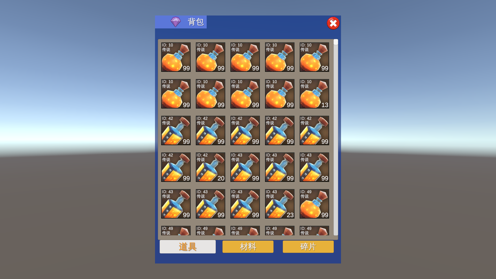

## Backpack functionality made with Unity.

### 1. Runtime Environment

- **Operating System**: Windows 11
- **Game Engine**: Unity 2022.3.53f1c1

---

### 2. How to Run

- Open the project folder with the correct version of Unity. Click the "Backpack" icon in the scene to view the backpack interface and items.
- A custom **GM command (Game Master Command)** has been implemented in the `Assets/Editor` directory. In the editor menu bar, navigate to `GMCmd > Create Local Backpack Data` to generate data for 2000 unique items, saved as a JSON file in the `Assets/StreamingAssets` directory. *(Note: The data has already been generated in advance.)*

---

### 3. Functionality

- **Tab Switching**: Supports switching between item categories: Prop（道具）, Material（材料）, and Fragment（碎片）.
- **High-Volume Data Rendering**: Efficiently displays thousands of items with smooth performance using virtualized scrolling and pooling.
- **Item Sorting**: Items are sorted by **quality (descending)** and **ID (ascending)**.
   Each item type is stacked up to 99 units per cell.

---

### 4. Project Highlights

- **Modular Architecture**: Implements an MVC (Model-View-Controller) pattern to decouple UI management, clearly separating data models, controllers, and view logic.
- **Data Persistence**: Utilizes `ScriptableObject` to manage item types, and JSON files to persist backpack data for saving and loading.
- **Optimized Scrolling Performance**: Custom-built virtualized scroll list that renders only visible cells in the viewport. Combined with object pooling and asynchronous loading, this ensures smooth browsing of large-scale backpack data.
